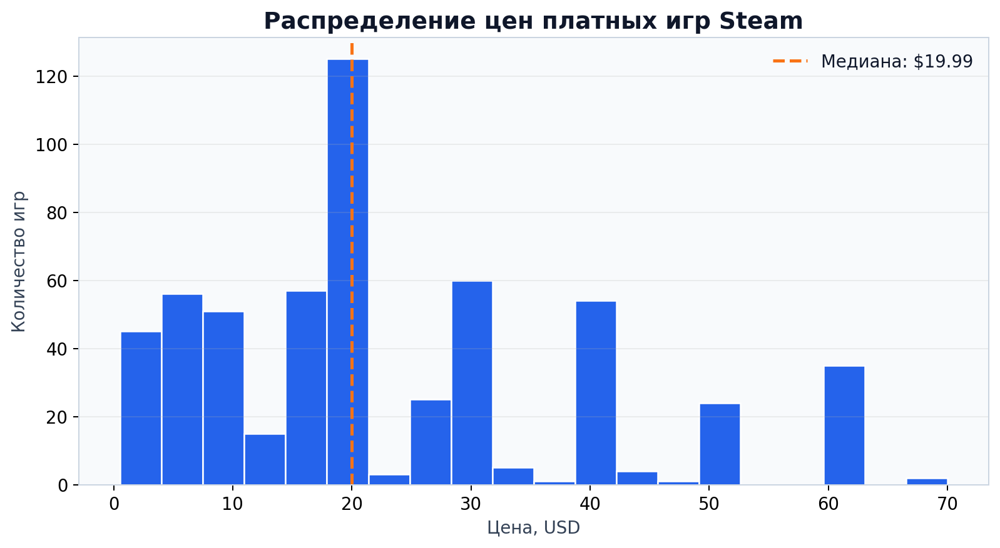
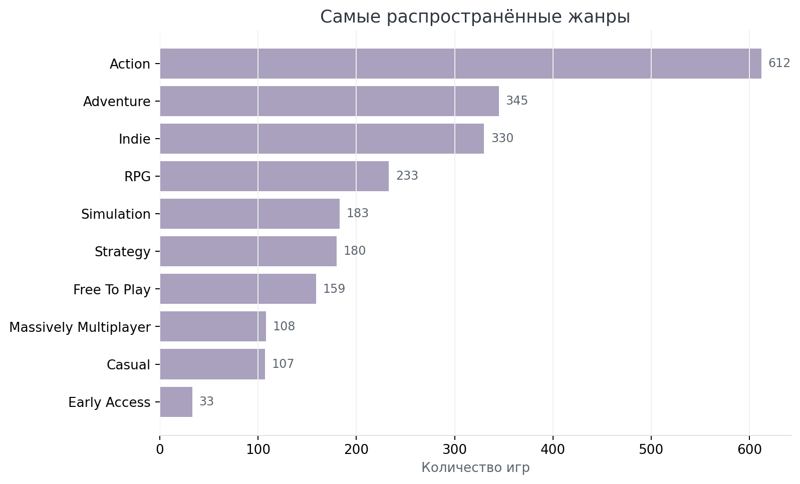
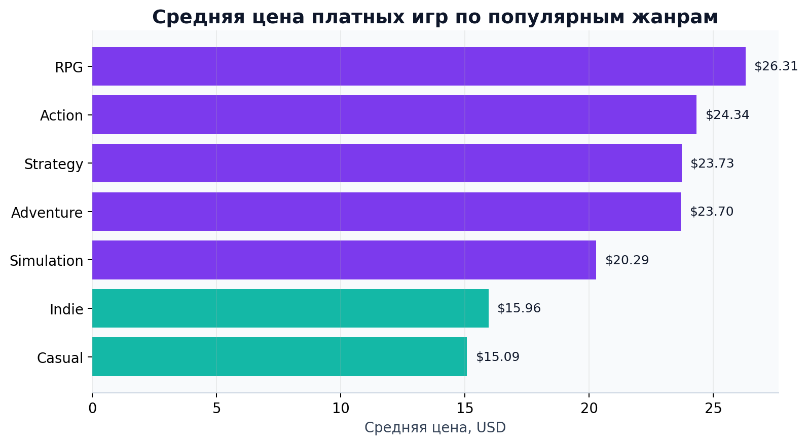

# Steam Games Analytics

Исследование игр в Steam: сбор данных через API, базы SQLite, SQL-запросы и графики.

В этом проекте я собрала данные об играх, привела их к единому виду и посмотрела, как распределяются цены, какие жанры встречаются чаще и чем отличаются бесплатные игры от платных.

**В итоговой выборке:** 906 игр · 30 жанров · 685 разработчиков · 470 издателей

---

## О проекте

1. получен список игр через SteamSpy API;
2. собрана подробная информация через Steam Store API;
3. найдены дубликаты и пропуски;
4. приведены даты и цены к единому формату;
5. разложены данные по связанным таблицам в SQLite;
6. проведен анализ с помощью SQL и Python.

Основные вопросы исследования:

- как распределены цены платных игр;
- какие жанры наиболее распространены;
- есть ли различия в цене между жанрами;
- как отличаются бесплатные и платные игры по числу рекомендаций;
- какие разработчики и издатели встречаются чаще всего.

## Данные

Для каждой игры собирались:

- `appid` и название;
- дата релиза;
- цена и валюта;
- жанры;
- разработчики и издатели;
- число рекомендаций;
- поддерживаемые платформы;
- признак free-to-play.

В выборку включались только игры. DLC и другие типы контента отсеивались на этапе сбора.

## Подготовка

Сырые ответы API оказались неоднородными, поэтому перед анализом я:

- удалила дубликаты по `appid`, оставляя наиболее полную запись;
- проверила обычные и скрытые пропуски;
- отделила отсутствующую цену от настоящего значения `0` у бесплатных игр;
- обработала даты в разных форматах и локалях;
- повторно запросила цены для региона США и привела их к USD;
- привела числовые, текстовые и логические поля к подходящим типам.

После очистки осталось **906 уникальных игр**.

## База данных

Готовые данные хранятся в `steam_games.db`. База состоит из семи таблиц:

| Основные данные | Справочники | Таблицы связей |
|---|---|---|
| `games` | `genres` | `game_genres` |
|  | `developers` | `game_developers` |
|  | `publishers` | `game_publishers` |

Жанры, разработчики и издатели вынесены в отдельные справочники, потому что у одной игры их может быть несколько. Для анализа таблицы соединяются по идентификаторам через `JOIN`.

## Результаты

- В выборке 768 платных и 138 бесплатных игр.
- Средняя цена платной игры с доступной ценой — **$23.11**, медианная — **$19.99**.
- Более высокое среднее связано с небольшим количеством дорогих игр.
- Самый частый жанр — **Action**: он встречается у 612 игр. Далее идут Adventure — 345 и Indie — 330.
- Средняя цена Indie в выборке составляет $13.45. Для сравнения: RPG — $21.32, Adventure — $20.41, Action — $20.08.
- Среднее число рекомендаций сильно зависит от отдельных популярных игр, поэтому для сравнения бесплатных и платных проектов полезнее смотреть на медиану.

Результаты относятся только к собранной выборке. Цены в Steam меняются со временем, зависят от региона и могут быть недоступны для части игр.

## Визуализации

### Распределение цен

Медиана ниже среднего значения: у распределения заметен правый хвост.



### Жанры

Action заметно лидирует по количеству игр в выборке.



### Средняя цена по жанрам

На графике показаны только платные игры, для которых удалось получить цену.



## Файлы

| Файл | Содержание |
|---|---|
| `steam_games_analysis.ipynb` | сбор, очистка, создание базы и анализ |
| `steam_games.db` | готовая база SQLite |
| `steam_games_raw.csv` | исходная выгрузка |
| `steam_games_clean.csv` | данные после очистки |
| `images/` | графики для README |
| `requirements.txt` | зависимости проекта |

## Как запустить

```bash
git clone https://github.com/soeurekane/steam-games-analytics.git
cd steam-games-analytics

python3 -m venv .venv
source .venv/bin/activate
python -m pip install -r requirements.txt

jupyter notebook steam_games_analysis.ipynb
```

Готовые CSV-файлы и база уже лежат в репозитории, поэтому анализ можно посмотреть без повторного сбора данных через API.

---

Проект выполнен как учебная работа по аналитике данных.
