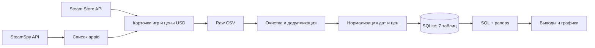
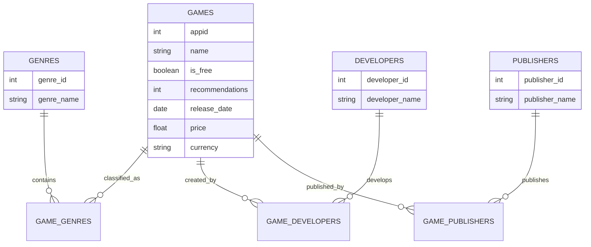

<div align="center">

# Steam Games Analytics

### От сырых API-ответов до нормализованной SQLite-базы и аналитических выводов

[](https://www.python.org/)
[](https://pandas.pydata.org/)
[](https://www.sqlite.org/)
[](steam_games_analysis.ipynb)


**Портфолио-проект по аналитике данных:** сбор данных из двух API, контроль качества, нормализация, SQL/Python-анализ и визуальный сторителлинг.

[Ноутбук](steam_games_analysis.ipynb) · [SQLite-база](steam_games.db) · [Очищенные данные](steam_games_clean.csv) · [Визуализации](#визуализации)

</div>

---

## Проект в цифрах

| **906** | **7** | **30** | **685** | **470** |
|:---:|:---:|:---:|:---:|:---:|
| уникальных игр | связанных таблиц | жанров | разработчиков | издателей |

| **$23.11** | **$19.99** | **768** | **138** |
|:---:|:---:|:---:|:---:|
| средняя цена платной игры* | медианная цена* | платных игр | бесплатных игр |

<sub>* Расчёт выполнен для платных игр, у которых цена была доступна в Steam Store API.</sub>

## Задача

Построить воспроизводимый аналитический пайплайн для исследования рынка Steam и ответить на вопросы:

- как распределены цены и есть ли заметные выбросы;
- какие жанры доминируют в выборке;
- как средняя цена различается между жанрами;
- чем отличаются бесплатные и платные игры по числу рекомендаций;
- какие разработчики и издатели встречаются чаще всего.

Проект показывает не только итоговые графики, но и весь путь данных: **API → очистка → реляционная модель → SQL → выводы**.

## Что демонстрирует проект

| Навык | Реализация |
|---|---|
| Сбор данных | Работа с SteamSpy API и Steam Store API через `requests`, обработка неуспешных ответов и паузы между запросами |
| Data Quality | Поиск дубликатов, явных и скрытых пропусков, проверка типов и логических несоответствий |
| Подготовка данных | Нормализация дат разных форматов, цен и валют; обработка вложенных списков |
| Data Modeling | Проектирование SQLite-схемы из 7 связанных таблиц и связей многие-ко-многим |
| SQL | `JOIN`, `GROUP BY`, агрегаты, фильтрация и рейтинги |
| Python Analytics | pandas, расчёт медиан, проверка распределений и подготовка витрин |
| Data Storytelling | Matplotlib-визуализации и интерпретация результатов с оговорками об ограничениях выборки |

## Пайплайн



### Сбор данных

SteamSpy API использовался для формирования выборки приложений, а Steam Store API — для подробных данных по каждому `appid`. В набор включались только объекты с типом `game`; DLC и другой контент отсеивались.

Собранные поля:

- `appid`, название и возрастное ограничение;
- free-to-play статус;
- разработчики, издатели и жанры;
- дата релиза и поддерживаемые платформы;
- число рекомендаций;
- цена и валюта.

Во время длительного сбора промежуточные результаты сохранялись в CSV, поэтому процесс можно было продолжать без потери уже полученных данных.

### Очистка и нормализация

1. Дубликаты группировались по `appid`; сохранялась наиболее полная запись.
2. Проверялись пустые списки, строки и настоящие `NaN`.
3. Нулевая цена у платной игры считалась недоступным значением, а не бесплатной раздачей.
4. Даты разных форматов и локалей приводились к `datetime`.
5. Цены повторно запрашивались для региона США (`cc=us`) и сохранялись в USD.
6. Числовые, логические и текстовые признаки приводились к корректным типам.

После подготовки осталось **906 уникальных игр**.

## Модель данных



### Таблицы SQLite

| Таблица | Назначение |
|---|---|
| `games` | Основные характеристики игр, цены, даты, рекомендации и платформы |
| `genres` | Справочник жанров |
| `game_genres` | Связь многие-ко-многим между играми и жанрами |
| `developers` | Справочник разработчиков |
| `game_developers` | Связь многие-ко-многим между играми и разработчиками |
| `publishers` | Справочник издателей |
| `game_publishers` | Связь многие-ко-многим между играми и издателями |

## Ключевые выводы

1. **Цена распределена несимметрично.** Небольшая группа дорогих игр сдвигает среднее вверх: $23.11 против медианы $19.99.
2. **Action — главный жанр выборки:** 612 игр. Далее идут Adventure — 345 и Indie — 330.
3. **Indie заметно дешевле ряда крупных жанров.** Средняя цена Indie — $13.45 против $21.32 у RPG, $20.41 у Adventure и $20.08 у Action.
4. **Среднее число рекомендаций может вводить в заблуждение** из-за отдельных хитов. Медиана устойчивее: около 38 919 у платных игр и 334 у бесплатных.
5. **Бесплатность не равна отсутствию интереса**, но внутри free-to-play сегмента наблюдается особенно сильная неоднородность популярности.

> Выводы описывают собранную выборку, а не весь каталог Steam. Цена зависит от региона, момента запроса, скидок и доступности карточки игры.

## Визуализации

### Распределение цен

Медиана ниже среднего — визуальный признак правого «хвоста» распределения.


### Самые распространённые жанры

Action представлен почти вдвое чаще, чем Adventure и Indie.


### Цена по популярным жанрам

Сравнение выполнено только для платных игр с доступной ценой.


## Структура репозитория

```text
steam-games-analytics/
├── images/
│   ├── avg_price_by_genre.png
│   ├── price_distribution.png
│   └── top_genres.png
├── steam_games_analysis.ipynb  # сбор, очистка, SQL и анализ
├── steam_games.db              # готовая SQLite-база
├── steam_games_raw.csv         # исходная выгрузка
├── steam_games_clean.csv       # очищенный набор
├── requirements.txt            # зависимости
└── README.md
```

## Быстрый запуск

```bash
git clone https://github.com/soeurekane/steam-games-analytics.git
cd steam-games-analytics

python3 -m venv .venv
source .venv/bin/activate       # Windows: .venv\Scripts\activate
python -m pip install -r requirements.txt

jupyter notebook steam_games_analysis.ipynb
```

Готовые CSV и `steam_games.db` уже включены в репозиторий: изучать SQL-анализ можно без повторного длительного сбора через API.

## Следующие шаги

- добавить первичные и внешние ключи с проверкой ссылочной целостности;
- разделить notebook на модули `extract`, `transform` и `load`;
- покрыть функции очистки автоматическими тестами;
- добавить данные SteamSpy о владельцах и времени игры;
- собрать интерактивный дашборд в Tableau, Power BI или Streamlit.

---

<div align="center">

Если проект оказался полезным, можно поставить ⭐

[GitHub-профиль автора](https://github.com/soeurekane)

</div>
