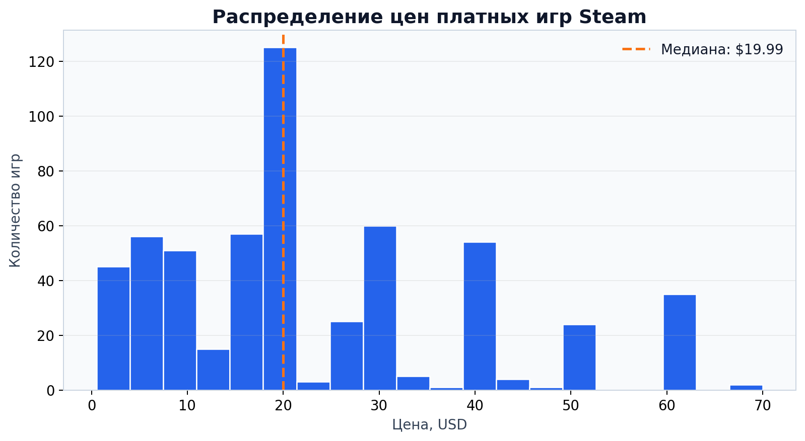
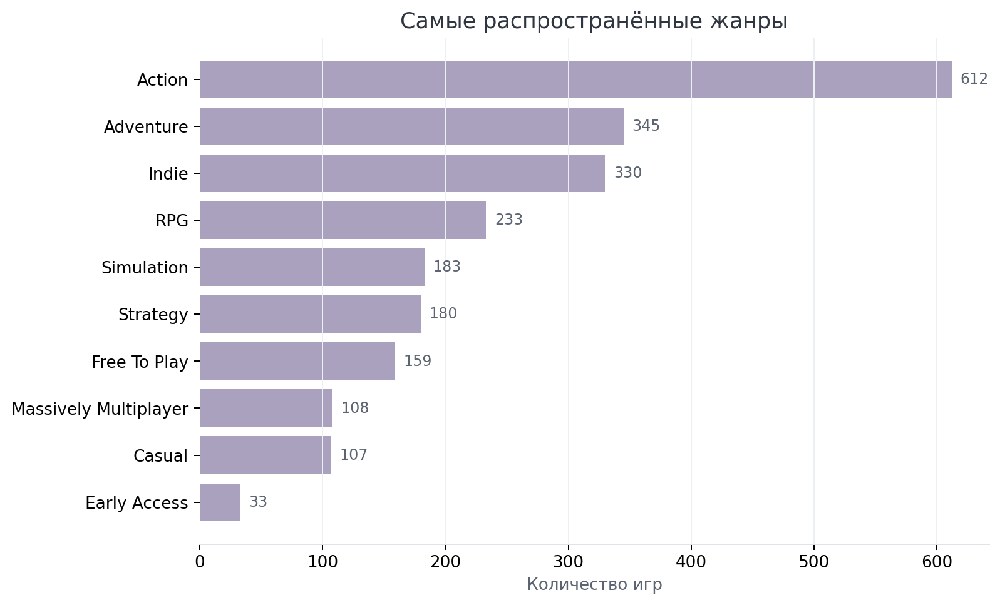
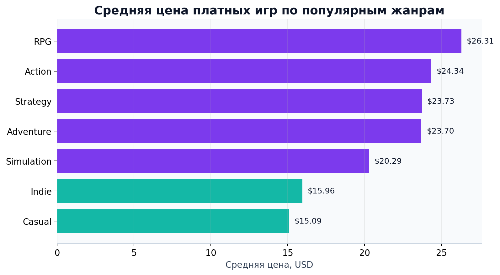

# Steam Games Analytics

Портфолио-проект по аналитике данных: сбор данных из API, очистка, проектирование реляционной базы, SQL-анализ и визуализация.

## Задача проекта

Построить небольшой аналитический пайплайн для данных Steam и ответить на вопросы:

- как распределяются цены платных игр;
- какие жанры встречаются чаще всего;
- как отличается средняя цена между жанрами;
- чем бесплатные и платные игры отличаются по числу рекомендаций;
- какие разработчики и издатели чаще представлены в выборке.

Проект сделан не на готовом очищенном датасете: данные собираются из внешних API, после чего проходят проверку и предобработку.

## Стек

- Python
- pandas
- requests
- SQLite
- SQL
- matplotlib
- Jupyter Notebook

## Что сделано

### 1. Сбор данных

- Получен список приложений через SteamSpy API.
- Детальная информация собрана через Steam Store API.
- DLC и другие типы контента исключены: в выборке остаются только игры.
- Для цен использован регион США, валюта приведена к USD.

### 2. Очистка и проверка качества

В сырых данных встретились дубликаты, пропуски и неоднородные форматы.

В ходе подготовки данных:

- найдены дубликаты по appid;
- для дублей оставлена наиболее полная запись;
- проверены явные и скрытые пропуски;
- разделены реальные бесплатные игры и платные игры с отсутствующей ценой;
- обработаны даты в разных форматах и локалях;
- приведены числовые, текстовые и логические поля к подходящим типам.

После очистки в итоговой выборке осталось **906 уникальных игр**.

### 3. Реляционная база SQLite

Данные разложены по семи связанным таблицам:

| Основные данные | Справочники | Таблицы связей |
|---|---|---|
| games | genres | game_genres |
|  | developers | game_developers |
|  | publishers | game_publishers |

Такой формат позволяет корректно хранить связи many-to-many: у одной игры может быть несколько жанров, разработчиков и издателей.

SQL используется для JOIN, группировок, агрегатов и аналитических выборок. Отдельные примеры запросов вынесены в [sql/analysis_queries.sql](sql/analysis_queries.sql).

## Основные результаты

- В выборке **768 платных** и **138 бесплатных** игр.
- Средняя цена платной игры с доступной ценой — **$23.11**, медианная — **$19.99**.
- Разница между средней и медианой указывает на правый хвост распределения и наличие небольшого числа дорогих игр.
- Самый распространённый жанр — **Action**: 612 игр. Далее идут Adventure — 345 и Indie — 330.
- Средняя цена Indie в выборке — **$13.45**; RPG — $21.32, Adventure — $20.41, Action — $20.08.
- Среднее число рекомендаций сильно чувствительно к отдельным очень популярным играм, поэтому при сравнении бесплатных и платных игр дополнительно использована медиана.

## Визуализации

### Распределение цен

### Топ жанров

### Средняя цена по жанрам

## Структура репозитория

| Файл | Содержание |
|---|---|
| steam_games_analysis.ipynb | сбор, очистка, создание базы, SQL-анализ и визуализации |
| steam_games_raw.csv | исходная выгрузка |
| steam_games_clean.csv | очищенные данные |
| steam_games.db | готовая SQLite-база |
| sql/analysis_queries.sql | отдельные SQL-запросы для анализа |
| images/ | графики для README |
| requirements.txt | зависимости |

## Как запустить

~~~bash
git clone https://github.com/soeurekane/steam-games-analytics.git
cd steam-games-analytics

python3 -m venv .venv
source .venv/bin/activate
python -m pip install -r requirements.txt

jupyter notebook steam_games_analysis.ipynb
~~~

Готовые CSV-файлы и база лежат в репозитории, поэтому результаты анализа можно посмотреть без повторного обращения к API.

## Ограничения

- Выборка не является полным каталогом Steam и зависит от набора приложений, полученного через SteamSpy.
- Цены в Steam меняются во времени и зависят от региона.
- Для части игр отдельные поля могут быть недоступны через API.
- Число рекомендаций не является прямой метрикой продаж или активной аудитории.

## Что показывает проект

Проект демонстрирует полный базовый цикл работы аналитика с данными: получение данных из внешнего источника, проверку качества, очистку, моделирование базы, SQL-анализ, расчёт агрегатов и визуализацию результатов.
