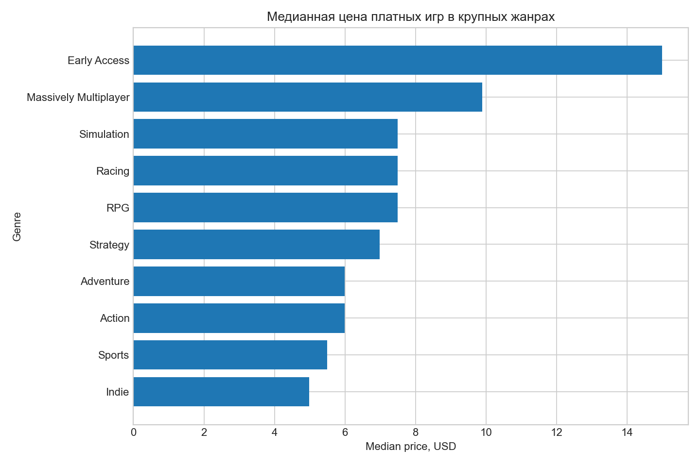
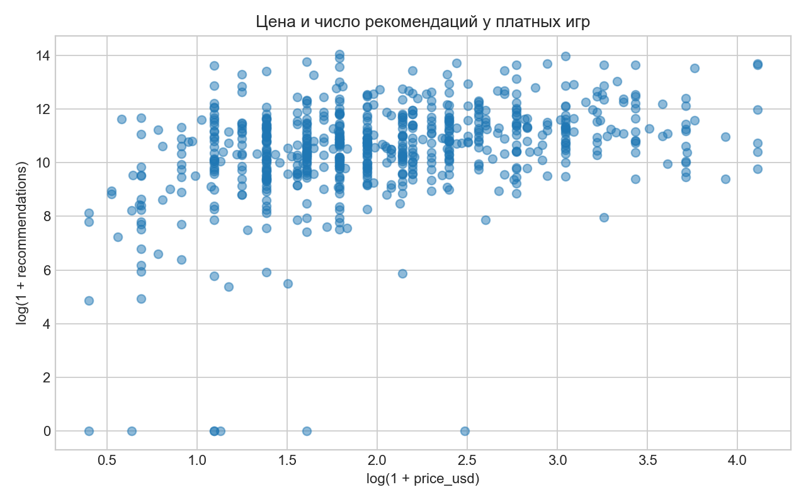

# Steam Games Analytics

Портфолио-проект Data Analyst: сбор данных из API, аудит качества, очистка, нормализация в SQLite, SQL-запросы и анализ в Python.

**906 игр · 7 связанных таблиц · 672 платные игры с подтверждённой USD-ценой · Spearman ρ = 0.362**

## Задача

Проект отвечает на четыре вопроса:

1. Как различается число рекомендаций у бесплатных и платных игр?
2. Сохраняется ли различие внутри периодов релиза?
3. Как различается медианная цена платных игр в крупных жанрах?
4. Как связаны текущая цена и накопленное число рекомендаций?

Главная точка входа — [выполненный ноутбук](notebooks/steam_games_portfolio.ipynb). Он последовательно воспроизводит подготовку данных, базу SQLite, SQL-анализ, расчёты и графики.

## Данные и сбор

- **SteamSpy API** — исходный список популярных приложений.
- **Steam Store API** — метаданные игр и отдельная проверка цен.
- Для проверки цены явно используются `cc='us'` и `l='english'`.
- Store API возвращает цену в минимальных единицах валюты; при сборе она переводится в доллары делением на 100.
- Для платных игр в анализ допускается только цена с `currency = 'USD'`. Если цена недоступна, остаётся `NaN`, а не искусственный ноль.

Метаданные и проверенные цены сохранены раздельно. Компактный файл `steam_games_prices_us.csv` оставлен в Git намеренно: он позволяет повторить анализ без 20–30 минут запросов к API и фиксирует валюту и время проверки. Исходная цена старой выгрузки сохраняется в подготовленном наборе как `price_original` только для аудита и не используется в анализе.

## Очистка и валидация

В ноутбуке проверяются:

- явные и скрытые пропуски, включая пустые списки;
- дубликаты по `appid` с выбором наиболее полной записи;
- логические и числовые типы;
- даты в разных форматах и локалях;
- отрицательные и нулевые цены платных игр;
- соответствие цены валюте USD;
- полнота кэша цен и изменения статуса free-to-play.

После удаления семи дублирующих строк остаётся **906 уникальных игр**. У 95 игр, которые Store API на момент проверки считал платными, подтверждённая цена отсутствует; эти записи не участвуют в ценовых расчётах.

## SQLite и SQL

Ноутбук создаёт базу `artifacts/steam_games.db` из семи нормализованных таблиц:

| Основная таблица | Справочники | Таблицы связей |
|---|---|---|
| `games` | `genres` | `game_genres` |
|  | `developers` | `game_developers` |
|  | `publishers` | `game_publishers` |

Жанры, разработчики и издатели имеют собственные первичные ключи. Таблицы связей используют составные первичные и внешние ключи; после записи выполняется `PRAGMA foreign_key_check`.

Отдельный файл [analysis_queries.sql](sql/analysis_queries.sql) содержит портфолио-примеры с `JOIN`, агрегацией, CTE и оконными функциями.

## Основные результаты

- **Action** — самый частый жанр в выборке: 612 игр. Далее идут Adventure (345) и Indie (330). Одна игра может принадлежать нескольким жанрам.
- Медиана рекомендаций составляет **328** у free-to-play и **38 790** у платных игр. Это описательное сравнение: группы сильно различаются по составу и возрасту.
- Среди жанров минимум с 10 платными играми самая высокая медианная цена в этом snapshot у **Early Access — $14.99**.
- Для 672 платных игр с подтверждённой USD-ценой ранговая корреляция цены и рекомендаций составляет **Spearman ρ = 0.362** — умеренная положительная связь, но не причинный эффект.
- После разбиения по периоду релиза связь цены и рекомендаций нестабильна: ρ меняется примерно от 0.016 для релизов 2024+ до 0.383 для 2015–2019. Это подтверждает, что общий коэффициент нельзя интерпретировать без учёта времени.





## Ограничения

- Выборка смещена к популярным приложениям SteamSpy и не представляет весь каталог Steam.
- Метаданные/рекомендации и цены собраны в разные моменты, поэтому это не единый синхронный snapshot.
- Рекомендации накапливаются со временем; стратификация по периоду релиза учитывает возраст игры лишь частично.
- Цена зависит от региона, момента проверки и скидок; для части платных игр она недоступна.
- Жанры пересекаются, поэтому жанровые группы не являются взаимоисключающими.
- В данных нет продаж, выручки, маркетинговых расходов и истории цен.

## Структура проекта

```text
steam-games-analytics/
├── README.md
├── requirements.txt
├── data/
│   ├── steam_games_raw.csv
│   └── steam_games_prices_us.csv
├── notebooks/
│   └── steam_games_portfolio.ipynb
├── sql/
│   └── analysis_queries.sql
└── images/
    ├── median_price_by_genre.png
    ├── price_vs_recommendations.png
    └── recommendations_free_vs_paid.png
```

`artifacts/steam_games_clean.csv` и `artifacts/steam_games.db` создаются ноутбуком и не хранятся в Git, потому что полностью воспроизводятся из двух компактных snapshot-файлов.

## Запуск

Требуется Python 3.10+.

```bash
git clone https://github.com/soeurekane/steam-games-analytics.git
cd steam-games-analytics

python3 -m venv .venv
source .venv/bin/activate
python -m pip install -r requirements.txt

jupyter notebook notebooks/steam_games_portfolio.ipynb
```

Ноутбук по умолчанию не обращается к API: `RUN_COLLECTION = False` и `REFRESH_PRICES = False`. Для просмотра подтверждённых результатов достаточно выполнить все ячейки сверху вниз.
